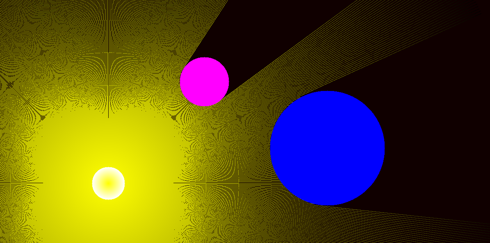

# 🚀Raytracing en C con SDL2



Este proyecto es una implementación básica de raytracing en C utilizando la biblioteca SDL2 para renderizar gráficos. El objetivo principal es entender los conceptos fundamentales del raytracing, como la reflexión de la luz, la difusión de los rayos y la interacción de la luz con objetos en una escena.

## ✨Características principales
- **Reflexión de rayos**: Los rayos de luz rebotan en los objetos de la escena, simulando un comportamiento realista.
- **Difusión de la luz**: La intensidad de la luz disminuye con la distancia, creando un efecto de difusión.
- **Interacción con objetos**: Los rayos detectan colisiones con círculos en la escena y se reflejan en ellos.
- **Efectos visuales**: Incluye efectos como motion blur y niebla para mejorar la apariencia visual.

## 🛠️Requisitos
- **SDL2**: La biblioteca gráfica utilizada para renderizar la escena.
- **Compilador C**: Se recomienda usar `gcc` o `clang`.
- **Sistema operativo**: Compatible con Windows, Linux y macOS.

## ⚙️Instalación
1. Clona este repositorio:
   ```bash
   git clone https://github.com/pandafter/raytracing_SDL2.git
   cd raytracing-sdl2
   ```
2. Instala SDL2:
    ### Ubuntu/Debian:
    ```bash
    sudo apt install libsdl2-dev
    ```
    ### macOS (con Homebrew):
    ```bash
    brew install sdl2
    ```
    ### Windows: Descarga SDL2 desde su sitio oficial y configura tu entorno de desarrollo.

3. Compila el proyecto
    ```wsl/bash
    make
    ```
4. Ejecuta el proyecto
    ```wsl/bash
    ./raytracing
    ```
## 🤝Como contribuir
¡Las contribuciones son bienvenidas! Si quieres mejorar este proyecto:
1. Haz un fork del repositorio.
2. Crea una rama con tus cambios:
    ```bash
    git checkout -b mi-nueva-funcionalidad
    ```
3. Realiza tus modificaciones y haz commit:
    ```bash
    git commit -m "feat: Agrego reflexiones dinámicas"
    ```
4. Envía un pull request a la rama main.


## 📄Licencia
Este proyecto está bajo la licencia MIT. Consulta el archivo [LICENSE](LICENCE.md) para más detalles.


## 👤Autor
Juan Nicolas Leyva Hoyos - [@pandafter](https://github.com/pandafter)

